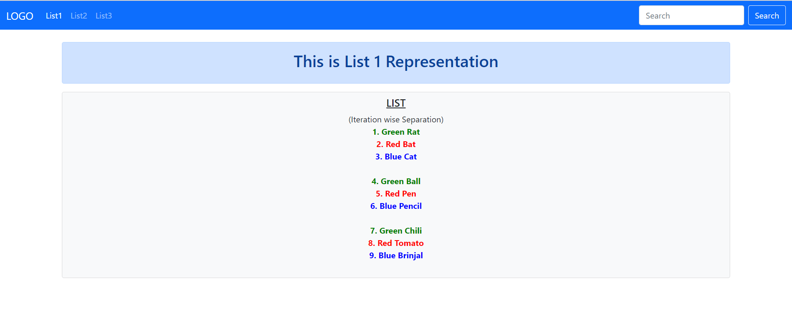
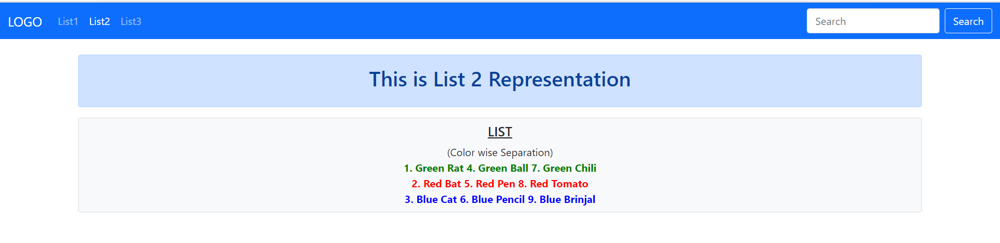
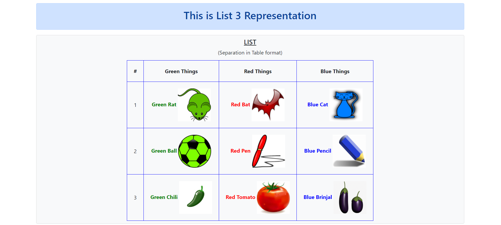

# 8Django_CycleTag_CommentTag_Usingbase.html_TemplateInheritance_TableFormat_PassingValues_Animation

#### 8. EighthWebProject
##### Title: 8Django_CycleTag_CommentTag_Usingbase.html_TemplateInheritance_TableFormat_PassingValues_Animation
It is about:
1. How to use various template tags in django project. it includes comment tag, cycle tag, extends tag, block tag if tag and forloop tag.
2. How to pass values and how to style them using CSS; Separated by Cycle arguments (in this case I have used 'row1' 'row2' and 'row3')
3. how the variables are arranged in table format.
4. how to set static image path.
5. how to put animation.

###### Links which helped me during this code development:
 1. https://www.geeksforgeeks.org/django-template-tags/
 2. https://www.geeksforgeeks.org/cycle-django-template-tags/
 3. https://stackoverflow.com/questions/36138669/how-to-use-django-cycle-tag
 4. https://stackoverflow.com/questions/6571966/how-do-i-get-odd-and-even-values-in-a-django-for-loop-template
 5. https://stackoverflow.com/questions/17951452/splitting-a-list-with-django-template-tags
 6. https://docs.djangoproject.com/en/3.1/ref/templates/builtins/
 
###### Set directory in the following way
 1. in manage.py folder; put statics and templates folder with their contents which I shared here.
 2. Set urls.py in Project folder.
 3. Set views.py in Application folder.
 
In case of further understanding; You can refer my previous repositories.
 
I have done list representation in 3 ways: for this; refer the output folder for the layout.
1. (Iteration wise Separation)
2. (Color wise Separation)
3. (Separation in Table format)

for all representation; I have set base.html (for common features in all templates)

###### List Representation(Iteration wise Separation)
in views.py; list1 method; a list is there with arguments; pass values as context variables.

    def list1(request):
        things = ['Green Ball','Red Bat','Blue Cat','Green Rat','Red Pen','Blue Pencil','Green Chili', 'Red Tomato','Blue Brinjal']
        context= {
            'things': things,
            }
        return render(request, 'list1.html', context)
        
 in Template 'list1.html'
 
     
    (Iteration wise Separation) 
    
    

        {{ forloop.counter }}. {{ i }}
        
          
        
    

    
    

The cycle tag produces one of its arguments each time when is encountered. The first argument is produced on the first encounter, the second argument on the second encounter, and so forth. Once all arguments are exhausted, the tag cycles to the first argument and produces it again. you can style it with its arguments treating as class attribute with CSS stylesheet as i did in this project (color: green, red, blue).

{{ forloop.counter }} # starting index 1
{{ forloop.counter0 }} # starting index 0
 Returns True and add line breaks if the value is divisible by 3, and False otherwise.

###### List Representation(Color wise Separation)
In views.py; list2 method; same as list1 method.

In Template 'list2.html'; I separated the list by color. and the logic is done by state variable which separate the classes (row1, row2 and row3)
 
    
    (Color wise Separation) 
    
    
        
        {{ forloop.counter }}. {{ i }}
        
    
     
    
    
        
        {{ forloop.counter }}. {{ i }}
        
    
     
    
    
        
        {{ forloop.counter }}. {{ i }}
        
    
    
    

###### List Representation((Separation in Table format))
In views.py; list3 method; first separate the list by index. and then zip them in a single variable 'data'.

    def list3(request):
        things = ['Green Ball','Red Bat','Blue Cat','Green Rat','Red Pen','Blue Pencil','Green Chili', 'Red Tomato','Blue Brinjal']
        """ g = [things[0], things[3], things[6]]
        r = [things[1], things[4], things[7]]
        b = [things[2], things[5], things[8]] """

        g = []
        r = []
        b = []

        i = 0
        j = 1
        k = 2

        while i < len(things):
            g.append(things[i])
            i = i + 3
        while j < len(things):
            r.append(things[j])
            j = j + 3
        while k < len(things):
            b.append(things[k])
            k = k + 3

        context= {
            'things': things,
            'data': zip(g,r,b),
            }
        return render(request, 'list3.html', context)

In template 'list3.html'
Now we have separate list by color; so only we can display them in td format simply by putting i, j and k value enclosed in django {{}}

    
    (Separation in Table format) 
    

    <table style="border: 1px solid black; border-collapse: collapse; margin-top: 12px;">
        <thead>
            <tr>
                <th style="padding:20px; border: 1px solid blue;">#</th>
                <th style="padding:20px; border: 1px solid blue;">Green Things</th>
                <th style="padding:20px; border: 1px solid blue;">Red Things</th>
                <th style="padding:20px; border: 1px solid blue;">Blue Things</th>
            </tr>
        </thead>
        <tbody>
            
            <tr>
                <td style="padding:20px; border: 1px solid blue;">
                    {{ forloop.counter }}
                </td>
                <td class="row1" style="padding:20px; border: 1px solid blue;">
                    {{ i }}
                    
                </td>
                <td class="row2" style="padding:20px; border: 1px solid blue;">
                    {{ j }}
                    
                </td>
                <td class="row3" style="padding:20px; border: 1px solid blue;">
                    {{ k }}
                    
                </td>
            </tr>
            
        </tbody>
    </table>
    

    

so, that is how list things are separated by color in table format.

Now, What is the trick behind this logic {{ forloop.counter }}{{ forloop.counter }}{{ forloop.counter }}.jpg/.png/.gif

I saved the images with 111.jpg, 222.jpg and 333.jpg for red things; 111.png, 222.png and 333.png for green things; 111.gif, 222.gif and 333.gif for blue things. So that code can work and separate the images by color.

###### How to add static images
1. first, add images folder in statics folder and add images in that folder.
2. second, add STATICFILES_DIRS in settings.py as i did in previous repositories; You can have an idea with this

       STATICFILES_DIRS = [
           os.path.join(BASE_DIR,'statics')
       ]
3. load static in base.html like this in head tag of html file. 
4. Now, call the images like this in img tag of html:

       src="/static/images/{{ forloop.counter }}{{ forloop.counter }}{{ forloop.counter }}.png"
       
###### How to put animation
1. first, add animate.css in css folder which is in statics folder
2. seconds add wow.js and wow-min.js in js folder which is also in statics folder.
3. link css connectivity in head tag of html:
 
       <link rel="stylesheet" href="/static/css/animate.css">
4. add this in the end of body tag

       
       
5. Call the animation like this:
   
       

          <h5><u>LIST</u></h5>
          
          
       

You can refer this link for see what are the options are available for animations. I have also applied animation in list3.html in img tag.
https://animate.style/

ProjectName: EighthWebProject

ApplicationName: Web

###### Result:

