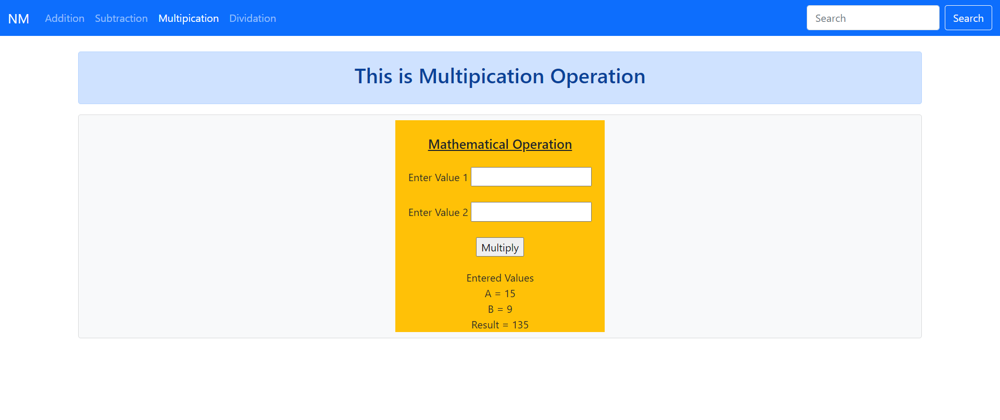

#### 9. NinthWebProject
###### Title: 9Django_BasicNumericalOperation_UsingForm_TemplateInheritance
A simple form is created without using forms.py which takes 2 number values. In this project, I have tried to do some mathematical operations; I have created templates for these each operation: Addition, Subtraction, Multipication, Dividation. 
You can look into the code, to get its idea.

This is about:
1. How Templates are rendered;
2. How values are Passed in the templates.
3. How forms values are passed to views.py.
4. How to apply some operation on them;
5. How to display the results;
6. Connectivity of Templates with Urls.py and Views.py

ProjectName: NinthWebProject

ApplicationName: WEB

###### Result:

