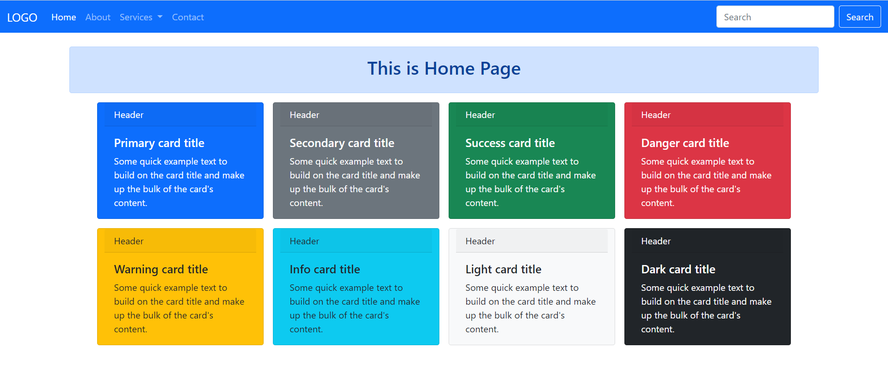
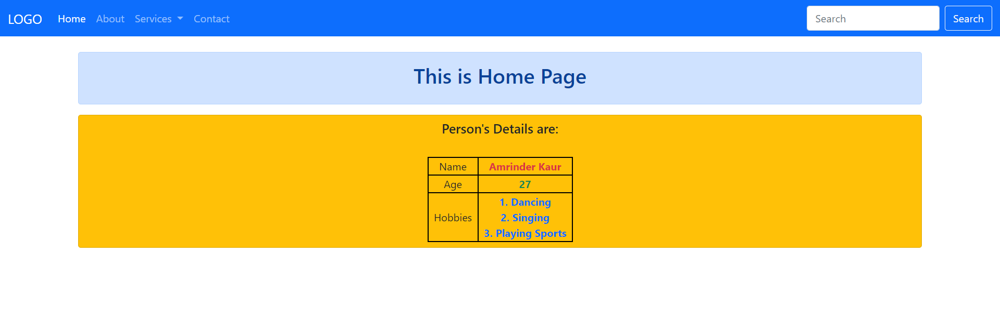
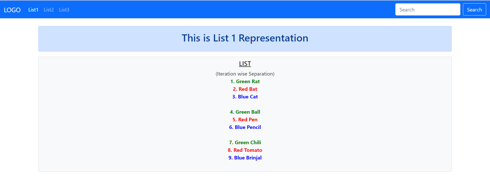
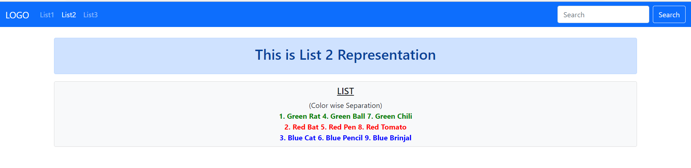
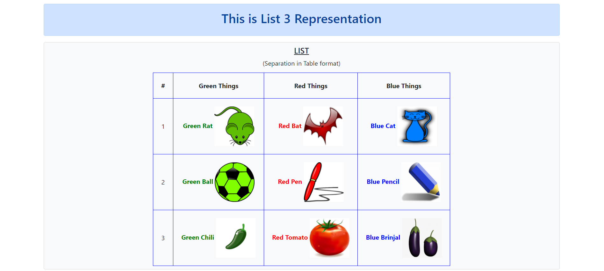
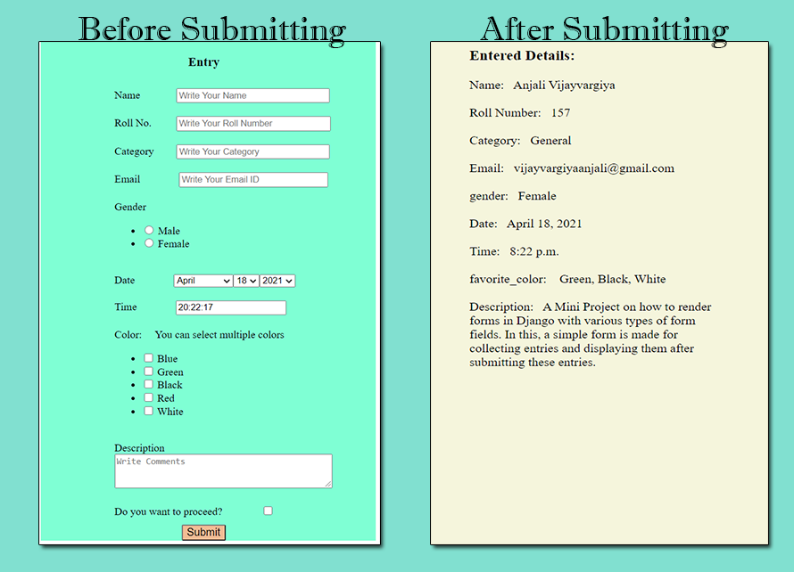

# Django-Github

## Contents:

1. FirstWebProject-----------------1Django_SimpleHTMLPage_Connectivity
2. SecondWebProject----------------2Django_SimpleHTMLPage_Bootstrap_Connectivity
3. ThirdWebProject-----------------3Django_SimpleHTMLPage_CSS_Connectivity
4. FourthWebProject----------------4Django_SimpleHTMLPage_CSS_JS_Bootstrap_Connectivity
5. FifthWebProject-----------------5Django_SimpleWebsite_LinkMultiplePages_NavbarLinks
6. SixthWebProject-----------------6Django_SimpleWebsite_LinkMultiplePages_NavbarLinks_Using_base.html_TemplateInheritance
7. SeventhWebProject---------------7Django_PassPythonVariables_toTemplates_Used_base.html_TemplateInheritance
8. EighthWebProject---8Django_CycleTag_CommentTag_Usingbase.html_TemplateInheritance_TableFormat_PassingValues_Animation
9. NinthWebProject-----------------9Django_BasicNumericalOperation_UsingForm_TemplateInheritance
10. WebProject10-------------------10Django_CRUD_Operation_FunctionBasedView_GFGBased
11. WebProject11-------------------11Django_CRUD_Operation_FunctionBasedView_ImplementationinTableFormat_EntryDetails
12. WebProject12-------------------12Django_CRUD_Operation_ClassBasedView_GFGBased
13. WebProject13-------------------13Django_CRUD_Operation_ClassBasedView_ImplementationinTableFormat_EntryDetails
14. WebProject14-------------------14Django_Rendering_Forms_InVariousWays
15. WebProject15------------15Django_RenderingForms_Widgets&itsAttrs_FormFieldVariousTypes_EntriesSaveInDatabase_FunctionBasedView
16. WebProject16------------16Django_VideoBasedImplementation_CRUD_FunctionBasedView_GeekyShows
17. WebProject17------------17Django_VideoBasedImplementation_CRUD_ClassBasedView_GeekyShows
18. WebProject18------------18Django_RenderingForms_Widgets&itsAttrs_FormFieldVariousTypes_EntriesSaveInDatabase_ClassBasedView

#### 6. SixthWebProject
##### Title: 6Django_SimpleWebsite_LinkMultiplePages_NavbarLinks_Using_base.html_TemplateInheritance
This is implemented by using base.html file; which contains common properties of all the files including header, footer and navbar.
All the remaining files use this base.html by using this line:

    
    
and we create block snippets for the distinguish part like this in base.html which are called with the values in that other html script in which you want to add data.

    <title>  | My Website</title>
    
In the other html file, you can call block snippets like this:

    

    Home

You can see the code for more understanding.

ProjectName: SixthWebProject

ApplicationName: Web

###### Result:

===========================================================================================================================================================================

#### 7. SeventhWebProject
##### Title: 7Django_PassPythonVariables_toTemplates_Used_base.html_TemplateInheritance
How do we pass a Python variables to templates?

And this is rather simple, Basically you just take the variable from views.py and pass it to the render function:

    def home(request):
        person= {'firstname': 'Amrinder', 'lastname': 'Kaur'}
        age = 27
        hobbies = ['Dancing', 'Singing', 'Playing Sports']
        context= {
            'person': person,
            'age': age,
            'hobbies': hobbies,
            }
        return render(request, 'index.html', context)
        
and call the variables by enclosing it within curly braces {{ }} in the template file:

              <table class="d-flex justify-content-center">
                    <tr>
                        <td class="col text-center" style="border: 2px solid black;">Name</td>
                        <td class="col text-center text-danger" style="border: 2px solid black;"><b>{{ person.firstname }} {{ person.lastname }}</b></td>
                    </tr>
                    <tr>
                        <td class="col text-center" style="border: 2px solid black;">Age</td>
                        <td class="col text-center text-success" style="border: 2px solid black;"><b>{{ age }}</b></td>
                    </tr>
                    <tr>
                        <td class="col px-2 text-center" style="border: 2px solid black;">Hobbies</td>
                        <td class="col px-2 text-center text-primary" style="border: 2px solid black;">
                            
                            <b>{{ forloop.counter }}. {{ hobby }}</b> 
                            
                        </td>
                    </tr>
                </table>

This will pass the Python variables to templates in Django.

ProjectName: SeventhWebProject

ApplicationName: Web

###### Result:

===========================================================================================================================================================================

#### 8. EighthWebProject
##### Title: 8Django_CycleTag_CommentTag_Usingbase.html_TemplateInheritance_TableFormat_PassingValues_Animation
It is about:
1. How to use various template tags in django project. it includes comment tag, cycle tag, extends tag, block tag if tag and forloop tag.
2. How to pass values and how to style them using CSS; Separated by Cycle arguments (in this case I have used 'row1' 'row2' and 'row3')
3. how the variables are arranged in table format.
4. how to set static image path.
5. how to put animation.

###### Links which helped me during this code development:
 1. https://www.geeksforgeeks.org/django-template-tags/
 2. https://www.geeksforgeeks.org/cycle-django-template-tags/
 3. https://stackoverflow.com/questions/36138669/how-to-use-django-cycle-tag
 4. https://stackoverflow.com/questions/6571966/how-do-i-get-odd-and-even-values-in-a-django-for-loop-template
 5. https://stackoverflow.com/questions/17951452/splitting-a-list-with-django-template-tags
 6. https://docs.djangoproject.com/en/3.1/ref/templates/builtins/
 
###### Set directory in the following way
 1. in manage.py folder; put statics and templates folder with their contents which I shared here.
 2. Set urls.py in Project folder.
 3. Set views.py in Application folder.
 
In case of further understanding; You can refer my previous repositories.
 
I have done list representation in 3 ways: for this; refer the output folder for the layout.
1. (Iteration wise Separation)
2. (Color wise Separation)
3. (Separation in Table format)

for all representation; I have set base.html (for common features in all templates)

###### List Representation(Iteration wise Separation)
in views.py; list1 method; a list is there with arguments; pass values as context variables.

    def list1(request):
        things = ['Green Ball','Red Bat','Blue Cat','Green Rat','Red Pen','Blue Pencil','Green Chili', 'Red Tomato','Blue Brinjal']
        context= {
            'things': things,
            }
        return render(request, 'list1.html', context)
        
 in Template 'list1.html'
 
     
    (Iteration wise Separation) 
    
    

        {{ forloop.counter }}. {{ i }}
        
          
        
    

    
    

The cycle tag produces one of its arguments each time when is encountered. The first argument is produced on the first encounter, the second argument on the second encounter, and so forth. Once all arguments are exhausted, the tag cycles to the first argument and produces it again. you can style it with its arguments treating as class attribute with CSS stylesheet as i did in this project (color: green, red, blue).

{{ forloop.counter }} # starting index 1
{{ forloop.counter0 }} # starting index 0
 Returns True and add line breaks if the value is divisible by 3, and False otherwise.

###### List Representation(Color wise Separation)
In views.py; list2 method; same as list1 method.

In Template 'list2.html'; I separated the list by color. and the logic is done by state variable which separate the classes (row1, row2 and row3)
 
    
    (Color wise Separation) 
    
    
        
        {{ forloop.counter }}. {{ i }}
        
    
     
    
    
        
        {{ forloop.counter }}. {{ i }}
        
    
     
    
    
        
        {{ forloop.counter }}. {{ i }}
        
    
    
    

###### List Representation((Separation in Table format))
In views.py; list3 method; first separate the list by index. and then zip them in a single variable 'data'.

    def list3(request):
        things = ['Green Ball','Red Bat','Blue Cat','Green Rat','Red Pen','Blue Pencil','Green Chili', 'Red Tomato','Blue Brinjal']
        """ g = [things[0], things[3], things[6]]
        r = [things[1], things[4], things[7]]
        b = [things[2], things[5], things[8]] """

        g = []
        r = []
        b = []

        i = 0
        j = 1
        k = 2

        while i < len(things):
            g.append(things[i])
            i = i + 3
        while j < len(things):
            r.append(things[j])
            j = j + 3
        while k < len(things):
            b.append(things[k])
            k = k + 3

        context= {
            'things': things,
            'data': zip(g,r,b),
            }
        return render(request, 'list3.html', context)

In template 'list3.html'
Now we have separate list by color; so only we can display them in td format simply by putting i, j and k value enclosed in django {{}}

    
    (Separation in Table format) 
    

    <table style="border: 1px solid black; border-collapse: collapse; margin-top: 12px;">
        <thead>
            <tr>
                <th style="padding:20px; border: 1px solid blue;">#</th>
                <th style="padding:20px; border: 1px solid blue;">Green Things</th>
                <th style="padding:20px; border: 1px solid blue;">Red Things</th>
                <th style="padding:20px; border: 1px solid blue;">Blue Things</th>
            </tr>
        </thead>
        <tbody>
            
            <tr>
                <td style="padding:20px; border: 1px solid blue;">
                    {{ forloop.counter }}
                </td>
                <td class="row1" style="padding:20px; border: 1px solid blue;">
                    {{ i }}
                    
                </td>
                <td class="row2" style="padding:20px; border: 1px solid blue;">
                    {{ j }}
                    
                </td>
                <td class="row3" style="padding:20px; border: 1px solid blue;">
                    {{ k }}
                    
                </td>
            </tr>
            
        </tbody>
    </table>
    

    

so, that is how list things are separated by color in table format.

Now, What is the trick behind this logic {{ forloop.counter }}{{ forloop.counter }}{{ forloop.counter }}.jpg/.png/.gif

I saved the images with 111.jpg, 222.jpg and 333.jpg for red things; 111.png, 222.png and 333.png for green things; 111.gif, 222.gif and 333.gif for blue things. So that code can work and separate the images by color.

###### How to add static images
1. first, add images folder in statics folder and add images in that folder.
2. second, add STATICFILES_DIRS in settings.py as i did in previous repositories; You can have an idea with this

       STATICFILES_DIRS = [
           os.path.join(BASE_DIR,'statics')
       ]
3. load static in base.html like this in head tag of html file. 
4. Now, call the images like this in img tag of html:

       src="/static/images/{{ forloop.counter }}{{ forloop.counter }}{{ forloop.counter }}.png"
       
###### How to put animation
1. first, add animate.css in css folder which is in statics folder
2. seconds add wow.js and wow-min.js in js folder which is also in statics folder.
3. link css connectivity in head tag of html:
 
       <link rel="stylesheet" href="/static/css/animate.css">
4. add this in the end of body tag

       
       
5. Call the animation like this:
   
       

          <h5><u>LIST</u></h5>
          
          
       

You can refer this link for see what are the options are available for animations. I have also applied animation in list3.html in img tag.
https://animate.style/

ProjectName: EighthWebProject

ApplicationName: Web

###### Result:

===========================================================================================================================================================================

#### 9. NinthWebProject
##### Title: 9Django_BasicNumericalOperation_UsingForm_TemplateInheritance
A simple form is created without using forms.py which takes 2 number values. In this project, I have tried to do some mathematical operations; I have created templates for these each operation: Addition, Subtraction, Multipication, Dividation. 
You can look into the code, to get its idea.

This is about:
1. How Templates are rendered;
2. How values are Passed in the templates.
3. How forms values are passed to views.py.
4. How to apply some operation on them;
5. How to display the results;
6. Connectivity of Templates with Urls.py and Views.py

ProjectName: NinthWebProject

ApplicationName: WEB

###### Result:

===========================================================================================================================================================================

#### 11. WebProject11
##### Title: 11Django_CRUD_Operation_FunctionBasedView_ImplementationinTableFormat_EntryDetails
A Small Project based on Function Based Views(FBV) implemented in Django. In this, a simple table format is prepared for making entries, checking their record, updating the record and deleting the particular record using CBV. While implementating this project, I have learnt many things:
1. How to use outer Bootstrap/HTML Templates outside the application folder.
2. How to add template path in settings.py
3. How to createsuperuser to see the admin page for watching the records in the database as well.
4. You can see admin page by the runserver-url/admin.
5. Difference between FBV and CBV.
6. How to use base.html file with the concept of Template Inheritance
7. Do not forget to call two commands after creation of model:
    1. python manage.py makemigrations
    2. python manage.py migrate
    3. then call; python manage.py runserver

ProjectName: WebProject11

ApplicationName: Web

###### Links:
1.  https://www.geeksforgeeks.org/create-view-function-based-views-django/
2.	https://www.geeksforgeeks.org/list-view-function-based-views-django/
3.	https://www.geeksforgeeks.org/detail-view-function-based-views-django/
4.	https://www.geeksforgeeks.org/update-view-function-based-views-django/
5.	https://www.geeksforgeeks.org/delete-view-function-based-views-django/
6.	https://www.geeksforgeeks.org/django-crud-create-retrieve-update-delete-function-based-views/?ref=rp
7.	https://djangobook.com/mdj2-django-admin/
8.	https://github.com/pranalikambli/django_crud_function_based_view
9.	https://medium.com/@ksarthak4ever/django-class-based-views-vs-function-based-view-e74b47b2e41b

###### Result:

===========================================================================================================================================================================

#### 13. WebProject13
##### Title: 13Django_CRUD_Operation_ClassBasedView_ImplementationinTableFormat_EntryDetails
A Small Project based on Class Based Views(CBV) implemented in Django. In this, a simple table format is prepared for making entries, checking their record, updating the record and deleting the particular record using CBV. While implementating this project, I have learnt many things:
1. How to use outer Bootstrap/HTML Templates outside the application folder.
2. How to give path for that template.
3. How to createsuperuser to see the admin page for watching the records in the database as well.
4. You can see admin page by the runserver-url/admin.
5. Understand the concept of form.as_p; form.as_table; form.as_ul.
6. How to use base.html file with the concept of Template Inheritance
7. Do not forget to call two commands after creation of model:
    1. python manage.py makemigrations
    2. python manage.py migrate
    3. then call; python manage.py runserver

ProjectName: WebProject13

ApplicationName: Web

###### Links:
1. https://www.geeksforgeeks.org/createview-class-based-views-django/
2. https://www.geeksforgeeks.org/listview-class-based-views-django/
3. https://www.geeksforgeeks.org/detailview-class-based-views-django/
4. https://www.geeksforgeeks.org/updateview-class-based-views-django/
5. https://www.geeksforgeeks.org/listview-class-based-views-django/
6. https://www.geeksforgeeks.org/class-based-generic-views-django-create-retrieve-update-delete/

For understanding the concept of makemigrations and migrate:
1. https://www.geeksforgeeks.org/django-basic-app-model-makemigrations-and-migrate/
2. https://stackoverflow.com/questions/29980211/django-1-8-whats-the-difference-between-migrate-and-makemigrations
3. https://dev.to/ashraf_zolkopli/django-makemigrations-migrate-collect-static-and-createsuperuser-15j8
4. https://sixfeetup.com/blog/django-migrate-or-makemigrations

###### Result:

===========================================================================================================================================================================

#### 14. WebProject14
##### Title: 14Django_Rendering_Forms_InVariousWays
A Mini Project on how to render forms in Django. In this, a simple form is made for collecting entries and displaying them after submitting these entries. There are 4 ways exists to render the Django forms. I have implemented all these in this project.
1. Render Django Forms as unordered list
2. Render Django Forms as paragraph
3. Render Django Forms as table
4. Render Django Form Fields Manually

I have commented in the above 3 ways for checking the working of the last way(Manually). If you want to check another specific way, just uncomment that way and comment the remainings ways.(You can have this idea by the code itself)

###### While implementating this project, I have learnt some things:
1. How to render forms using models.py and forms.py.
2. How to call them in views.py
3. Connect the views in urls.py
4. How to createsuperuser to see the admin page for watching the records in the database as well.
7. You can see admin page by the runserver-url/admin.
8. Understand the concept of form.as_p; form.as_table; form.as_ul.
9. Use of *args and ** kwargs in Python
10. Do not forget to call two commands after creation of model:
    1. python manage.py makemigrations
    2. python manage.py migrate
    3. then call; python manage.py runserver

ProjectName: WebProject14

ApplicationName: Web

###### Links:
1. https://www.geeksforgeeks.org/django-forms/
2. https://www.geeksforgeeks.org/django-forms/#form-fields
3. https://www.geeksforgeeks.org/form-as_ul-render-django-forms-as-list/
4. https://www.geeksforgeeks.org/form-as_p-render-django-forms-as-paragraph/
5. https://www.geeksforgeeks.org/form-as_table-render-django-forms-as-table/
6. https://www.geeksforgeeks.org/render-django-form-fields-manually/
7. https://www.geeksforgeeks.org/args-kwargs-python/

###### Result:

===========================================================================================================================================================================

#### 15. WebProject15
##### Title: 15Django_RenderingForms_Widgets&itsAttrs_FormFieldVariousTypes_EntriesSaveInDatabase_FunctionBasedView
A Mini Project on how to render forms in Django with various types of form fields. In this, a simple form is made for collecting entries and displaying them after submitting these entries. There are 4 ways exists to render the Django forms. I have implemented all these in this project.
1. Render Django Forms as unordered list
2. Render Django Forms as paragraph
3. Render Django Forms as table
4. Render Django Form Fields Manually

I have commented in the above 3 ways for checking the working of the last way(Manually). If you want to check another specific way, just uncomment that way and comment the remainings ways.(You can have this idea by the code itself)

###### I have defined various types of form-fields:
1. name; CharField; Increase the textinput size by widget attrs; define placeholder value by widget attrs.
2. rollno; IntegerField; Increase the NumberInput size with using style by widgets attrs and define placeholder value by widget attrs
3. category; CharField; Increase the textinput size by widget attrs; define placeholder value by widget attrs.
4. email; EmailField; Increase the textinput size with using style by widgets attrs and define placeholder value by widget attrs
5. There are 2 ways to define choicefield:
    1. Only in models.py
       define gender_choice and then gender = models.CharField(max_length=6,null=True, choices=gender_choice)
    2. By models.py and forms.py
        define gender = models.CharField(max_length=6,null=True) in models.py
        
        then in forms.py, use
        
        gender_choices = [('Male','Male'),('Female','Female'),]
        
        gender = forms.ChoiceField(widget=forms.RadioSelect, choices=gender_choices)
6. date; models.DateField(null=True) in models.py; forms.DateField(widget=forms.SelectDateWidget, initial=date.today) in forms.py
7. time; models.TimeField(null=True) in models.py; forms.TimeField(initial=datetime.now().strftime("%H:%M:%S")) in forms.py
8. FAVORITE_COLORS_CHOICES = [('Blue', 'Blue'),('Green', 'Green'), ('Black', 'Black'), ('Red','Red'),('White','White')]
   favorite_color = MultiSelectField(choices=FAVORITE_COLORS_CHOICES,null=True) in models.py
9. description = models.CharField(max_length=200, null=True) in models.py; description = forms.CharField(widget=forms.Textarea(attrs={'rows':3,'cols':42,'placeholder': 'Write Comments'})) in forms.py
10. agree = forms.BooleanField() in forms.py (just used for confirmation for submitting)

###### While implementating this project, I have learnt some things:
1. It is necessary to assign max_length parameters with defining fields in models.py.
2. When adding extra fields in models.py; first define their max_length, and define "null=True" before running python manage.py makemirations and migrate.

https://blog.csdn.net/weixin_39833509/article/details/105770515

3. There are 2 ways to define choice fields.
4. How to define date and time fields.

https://www.programiz.com/python-programming/datetime/current-datetime

5. In case of Multiple Choice field; if we define this field in forms.py then multiple values do not save in database. if we follow the same approach as choicefield. So, i have used python library namely MultiSelectField; and by this we can define this type of fields in models.py and save the multiple values in database. 

https://www.geeksforgeeks.org/multiplechoicefield-django-forms/
https://pypi.org/project/django-multiselectfield/
https://www.youtube.com/watch?v=5jWJBpS0tkg

6. How to increase the size of django-forms charfields.
7. How to add class, id, placeholder, size, rows and cols attributes in widget. I have shared link below.
8. How to render forms using models.py and forms.py; How to call them in views.py; Connect the views in urls.py.
9. For database visualization; You can see localhost/admin page after creating superuser.
10. Do not forget to call two commands after creation of model:
    1. python manage.py makemigrations
    2. python manage.py migrate
    3. then call; python manage.py runserver

###### In case, if form is not submitted and rendering the same entry page; then check following things:
1. First of all, fill all the fields.
2. Correct Email format; such as vijay@gmail.com
3. Check Time format; it should be like this- 09:00:20
4. Select at least one color
5. Select gender as well
6. Click on proceed checkbox button

if all the entries are in corrent format; then you will able to see the detail.html page.

ProjectName: WebProject15

ApplicationName: Web

###### Links:
1. https://www.geeksforgeeks.org/django-form-field-custom-widgets/
2. https://www.ordinarycoders.com/blog/article/using-django-form-fields-and-widgets
3. https://stackoverflow.com/questions/58563294/how-does-return-renderrequest-path-path-works-in-django
4. https://stackoverflow.com/questions/53594745/what-is-the-use-of-cleaned-data-in-django
5. https://stackoverflow.com/questions/35452976/how-to-increase-django-forms-form-charfield-size
6. https://stackoverflow.com/questions/19489699/how-to-add-class-id-placeholder-attributes-to-a-field-in-django-model-forms
7. https://www.programcreek.com/python/example/63776/django.forms.widgets.TextInput Example8

###### Result:

===========================================================================================================================================================================

####  18. WebProject18
##### Title: 18Django_RenderingForms_Widgets&itsAttrs_FormFieldVariousTypes_EntriesSaveInDatabase_ClassBasedView
Project is based on WebProject15. This differs by a Class based view implementation. The results is same as of WebProject15. This differs from back-end coding.

###### While implementating this project, I have learnt some things:
1. How to save templates in application itself. So, no need to define templates in settings.py
2. How CBV implementation is done by defining Model and Forms.
3. How we can define templateview.
4. How to call get and post method in CBV mode. 

###### In case, if form is not submitted and rendering the same entry page; then check following things:
1. First of all, fill all the fields.
2. Correct Email format; such as vijay@gmail.com
3. Check Time format; it should be like this- 09:00:20
4. Select at least one color
5. Select gender as well
6. Click on proceed checkbox button

if all the entries are in corrent format; then you will able to see the detail.html page.

ProjectName: WebProject18

ApplicationName: Web

###### Links:
1. https://www.youtube.com/watch?v=OPc_oMgjhpM&t=4s
2. https://www.youtube.com/watch?v=XQjaTUwTJRY&t=1s

###### Result:

===========================================================================================================================================================================

