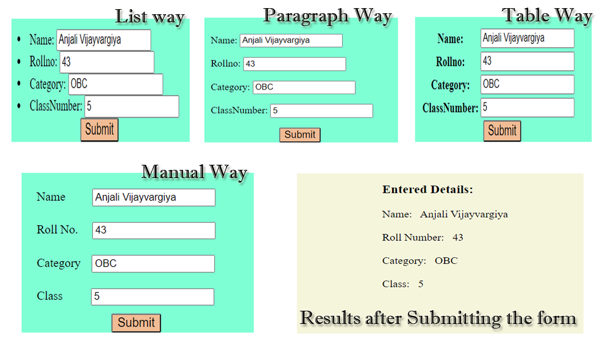

# Django-Github

### Contents:

1. FirstWebProject-----------------1Django_SimpleHTMLPage_Connectivity
2. SecondWebProject----------------2Django_SimpleHTMLPage_Bootstrap_Connectivity
3. ThirdWebProject-----------------3Django_SimpleHTMLPage_CSS_Connectivity
4. FourthWebProject----------------4Django_SimpleHTMLPage_CSS_JS_Bootstrap_Connectivity
5. FifthWebProject-----------------5Django_SimpleWebsite_LinkMultiplePages_NavbarLinks
6. SixthWebProject-----------------6Django_SimpleWebsite_LinkMultiplePages_NavbarLinks_Using_base.html_TemplateInheritance
7. SeventhWebProject---------------7Django_PassPythonVariables_toTemplates_Used_base.html_TemplateInheritance
8. EighthWebProject---8Django_CycleTag_CommentTag_Usingbase.html_TemplateInheritance_TableFormat_PassingValues_Animation
9. NinthWebProject-----------------9Django_BasicNumericalOperation_UsingForm_TemplateInheritance
10. WebProject10-------------------Django_CRUD_Operation_FunctionBasedView_GFGBased
11. WebProject11-------------------11Django_CRUD_Operation_FunctionBasedView_ImplementationinTableFormat_EntryDetails
12. WebProject12-------------------Django_CRUD_Operation_ClassBasedView_GFGBased
13. WebProject13-------------------13Django_CRUD_Operation_ClassBasedView_ImplementationinTableFormat_EntryDetails
14. WebProject14-------------------14Django_Rendering_Forms_InVariousWays
15. WebProject15-------------------15Django_RenderingForms_Widgets&itsAttrs_FormFieldVariousTypes_EntriesSaveInDatabase

#### 9. NinthWebProject
###### Title: 9Django_BasicNumericalOperation_UsingForm_TemplateInheritance
A simple form is created without using forms.py which takes 2 number values. In this project, I have tried to do some mathematical operations; I have created templates for these each operation: Addition, Subtraction, Multipication, Dividation. 
You can look into the code, to get its idea.

This is about:
1. How Templates are rendered;
2. How values are Passed in the templates.
3. How forms values are passed to views.py.
4. How to apply some operation on them;
5. How to display the results;
6. Connectivity of Templates with Urls.py and Views.py

ProjectName: NinthWebProject

ApplicationName: WEB

###### Result:

#### 11. WebProject11
###### Title: 11Django_CRUD_Operation_FunctionBasedView_ImplementationinTableFormat_EntryDetails
A Small Project based on Function Based Views(FBV) implemented in Django. In this, a simple table format is prepared for making entries, checking their record, updating the record and deleting the particular record using CBV. While implementating this project, I have learnt many things:
1. How to use outer Bootstrap/HTML Templates outside the application folder.
2. How to add template path in settings.py
3. How to createsuperuser to see the admin page for watching the records in the database as well.
4. You can see admin page by the runserver-url/admin.
5. Difference between FBV and CBV.
6. How to use base.html file with the concept of Template Inheritance
7. Do not forget to call two commands after creation of model:
    1. python manage.py makemigrations
    2. python manage.py migrate
    3. then call; python manage.py runserver

ProjectName: WebProject11

ApplicationName: Web

###### Links:
1.  https://www.geeksforgeeks.org/create-view-function-based-views-django/
2.	https://www.geeksforgeeks.org/list-view-function-based-views-django/
3.	https://www.geeksforgeeks.org/detail-view-function-based-views-django/
4.	https://www.geeksforgeeks.org/update-view-function-based-views-django/
5.	https://www.geeksforgeeks.org/delete-view-function-based-views-django/
6.	https://www.geeksforgeeks.org/django-crud-create-retrieve-update-delete-function-based-views/?ref=rp
7.	https://djangobook.com/mdj2-django-admin/
8.	https://github.com/pranalikambli/django_crud_function_based_view
9.	https://medium.com/@ksarthak4ever/django-class-based-views-vs-function-based-view-e74b47b2e41b

###### Result:

#### 13. WebProject13
###### Title: 13Django_CRUD_Operation_ClassBasedView_ImplementationinTableFormat_EntryDetails
A Small Project based on Class Based Views(CBV) implemented in Django. In this, a simple table format is prepared for making entries, checking their record, updating the record and deleting the particular record using CBV. While implementating this project, I have learnt many things:
1. How to use outer Bootstrap/HTML Templates outside the application folder.
2. How to give path for that template.
3. How to createsuperuser to see the admin page for watching the records in the database as well.
4. You can see admin page by the runserver-url/admin.
5. Understand the concept of form.as_p; form.as_table; form.as_ul.
6. How to use base.html file with the concept of Template Inheritance
7. Do not forget to call two commands after creation of model:
    1. python manage.py makemigrations
    2. python manage.py migrate
    3. then call; python manage.py runserver

ProjectName: WebProject13

ApplicationName: Web

###### Links:
1. https://www.geeksforgeeks.org/createview-class-based-views-django/
2. https://www.geeksforgeeks.org/listview-class-based-views-django/
3. https://www.geeksforgeeks.org/detailview-class-based-views-django/
4. https://www.geeksforgeeks.org/updateview-class-based-views-django/
5. https://www.geeksforgeeks.org/listview-class-based-views-django/
6. https://www.geeksforgeeks.org/class-based-generic-views-django-create-retrieve-update-delete/

For understanding the concept of makemigrations and migrate:
1. https://www.geeksforgeeks.org/django-basic-app-model-makemigrations-and-migrate/
2. https://stackoverflow.com/questions/29980211/django-1-8-whats-the-difference-between-migrate-and-makemigrations
3. https://dev.to/ashraf_zolkopli/django-makemigrations-migrate-collect-static-and-createsuperuser-15j8
4. https://sixfeetup.com/blog/django-migrate-or-makemigrations

###### Result:

#### 14. WebProject14
###### Title: 14Django_Rendering_Forms_InVariousWays
A Mini Project on how to render forms in Django. In this, a simple form is made for collecting entries and displaying them after submitting these entries. There are 4 ways exists to render the Django forms. I have implemented all these in this project.
1. Render Django Forms as unordered list
2. Render Django Forms as paragraph
3. Render Django Forms as table
4. Render Django Form Fields Manually

I have commented in the above 3 ways for checking the working of the last way(Manually). If you want to check another specific way, just uncomment that way and comment the remainings ways.(You can have this idea by the code itself)

While implementating this project, I have learnt some things:
1. How to render forms using models.py and forms.py.
2. How to call them in views.py
3. Connect the views in urls.py
4. How to createsuperuser to see the admin page for watching the records in the database as well.
7. You can see admin page by the runserver-url/admin.
8. Understand the concept of form.as_p; form.as_table; form.as_ul.
9. Use of *args and ** kwargs in Python
10. Do not forget to call two commands after creation of model:
    1. python manage.py makemigrations
    2. python manage.py migrate
    3. then call; python manage.py runserver

ProjectName: WebProject14

ApplicationName: Web

###### Links:
1. https://www.geeksforgeeks.org/django-forms/
2. https://www.geeksforgeeks.org/django-forms/#form-fields
3. https://www.geeksforgeeks.org/form-as_ul-render-django-forms-as-list/
4. https://www.geeksforgeeks.org/form-as_p-render-django-forms-as-paragraph/
5. https://www.geeksforgeeks.org/form-as_table-render-django-forms-as-table/
6. https://www.geeksforgeeks.org/render-django-form-fields-manually/
7. https://www.geeksforgeeks.org/args-kwargs-python/

###### Result:

#### 15. WebProject15
###### Title: 15Django_RenderingForms_Widgets&itsAttrs_FormFieldVariousTypes_EntriesSaveInDatabase
A Mini Project on how to render forms in Django with various types of form fields. In this, a simple form is made for collecting entries and displaying them after submitting these entries. There are 4 ways exists to render the Django forms. I have implemented all these in this project.
1. Render Django Forms as unordered list
2. Render Django Forms as paragraph
3. Render Django Forms as table
4. Render Django Form Fields Manually

I have commented in the above 3 ways for checking the working of the last way(Manually). If you want to check another specific way, just uncomment that way and comment the remainings ways.(You can have this idea by the code itself)

I have defined various types of form-fields:
1. name; CharField; Increase the textinput size by widget attrs; define placeholder value by widget attrs.
2. rollno; IntegerField; Increase the NumberInput size with using style by widgets attrs and define placeholder value by widget attrs
3. category; CharField; Increase the textinput size by widget attrs; define placeholder value by widget attrs.
4. email; EmailField; Increase the textinput size with using style by widgets attrs and define placeholder value by widget attrs
5. There are 2 ways to define choicefield:
    1. Only in models.py
       define gender_choice and then gender = models.CharField(max_length=6,null=True, choices=gender_choice)
    2. By models.py and forms.py
        define gender = models.CharField(max_length=6,null=True) in models.py
        
        then in forms.py, use
        
        gender_choices = [('Male','Male'),('Female','Female'),]
        
        gender = forms.ChoiceField(widget=forms.RadioSelect, choices=gender_choices)
6. date; models.DateField(null=True) in models.py; forms.DateField(widget=forms.SelectDateWidget, initial=date.today) in forms.py
7. time; models.TimeField(null=True) in models.py; forms.TimeField(initial=datetime.now().strftime("%H:%M:%S")) in forms.py
8. FAVORITE_COLORS_CHOICES = [('Blue', 'Blue'),('Green', 'Green'), ('Black', 'Black'), ('Red','Red'),('White','White')]
   favorite_color = MultiSelectField(choices=FAVORITE_COLORS_CHOICES,null=True) in models.py
9. description = models.CharField(max_length=200, null=True) in models.py; description = forms.CharField(widget=forms.Textarea(attrs={'rows':3,'cols':42,'placeholder': 'Write Comments'})) in forms.py
10. agree = forms.BooleanField() in forms.py (just used for confirmation for submitting)

While implementating this project, I have learnt some things:
1. It is necessary to assign max_length parameters with defining fields in models.py.
2. When adding extra fields in models.py; first define their max_length, and define "null=True" before running python manage.py makemirations and migrate.

https://blog.csdn.net/weixin_39833509/article/details/105770515

3. There are 2 ways to define choice fields.
4. How to define date and time fields.

https://www.programiz.com/python-programming/datetime/current-datetime

5. In case of Multiple Choice field; if we define this field in forms.py then multiple values do not save in database. if we follow the same approach as choicefield. So, i have used python library namely MultiSelectField; and by this we can define this type of fields in models.py and save the multiple values in database. 

https://www.geeksforgeeks.org/multiplechoicefield-django-forms/
https://pypi.org/project/django-multiselectfield/
https://www.youtube.com/watch?v=5jWJBpS0tkg

6. 

7. 
8. 
9. How to render forms using models.py and forms.py.
10. How to call them in views.py
11. Connect the views in urls.py
12. How to createsuperuser to see the admin page for watching the records in the database as well.
13. You can see admin page by the runserver-url/admin.
14. Understand the concept of form.as_p; form.as_table; form.as_ul.
15. Use of *args and ** kwargs in Python
16. Do not forget to call two commands after creation of model:
    1. python manage.py makemigrations
    2. python manage.py migrate
    3. then call; python manage.py runserver

ProjectName: WebProject15

ApplicationName: Web

###### Links:
1. https://www.geeksforgeeks.org/django-form-field-custom-widgets/
2. https://www.ordinarycoders.com/blog/article/using-django-form-fields-and-widgets
3. https://stackoverflow.com/questions/58563294/how-does-return-renderrequest-path-path-works-in-django
4. https://stackoverflow.com/questions/53594745/what-is-the-use-of-cleaned-data-in-django
5. https://stackoverflow.com/questions/35452976/how-to-increase-django-forms-form-charfield-size
6. https://stackoverflow.com/questions/19489699/how-to-add-class-id-placeholder-attributes-to-a-field-in-django-model-forms
7. https://www.programcreek.com/python/example/63776/django.forms.widgets.TextInput Example8

###### Result:

