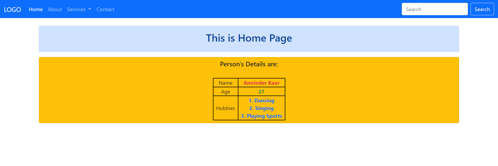

#### 7. SeventhWebProject
##### Title: 7Django_PassPythonVariables_toTemplates_Used_base.html_TemplateInheritance
How do we pass a Python variables to templates?

And this is rather simple, Basically you just take the variable from views.py and pass it to the render function:

    def home(request):
        person= {'firstname': 'Amrinder', 'lastname': 'Kaur'}
        age = 27
        hobbies = ['Dancing', 'Singing', 'Playing Sports']
        context= {
            'person': person,
            'age': age,
            'hobbies': hobbies,
            }
        return render(request, 'index.html', context)
        
and call the variables by enclosing it within curly braces {{ }} in the template file:

              <table class="d-flex justify-content-center">
                    <tr>
                        <td class="col text-center" style="border: 2px solid black;">Name</td>
                        <td class="col text-center text-danger" style="border: 2px solid black;"><b>{{ person.firstname }} {{ person.lastname }}</b></td>
                    </tr>
                    <tr>
                        <td class="col text-center" style="border: 2px solid black;">Age</td>
                        <td class="col text-center text-success" style="border: 2px solid black;"><b>{{ age }}</b></td>
                    </tr>
                    <tr>
                        <td class="col px-2 text-center" style="border: 2px solid black;">Hobbies</td>
                        <td class="col px-2 text-center text-primary" style="border: 2px solid black;">
                            
                            <b>{{ forloop.counter }}. {{ hobby }}</b> 
                            
                        </td>
                    </tr>
                </table>

This will pass the Python variables to templates in Django.

ProjectName: SeventhWebProject

ApplicationName: Web

###### Result:

