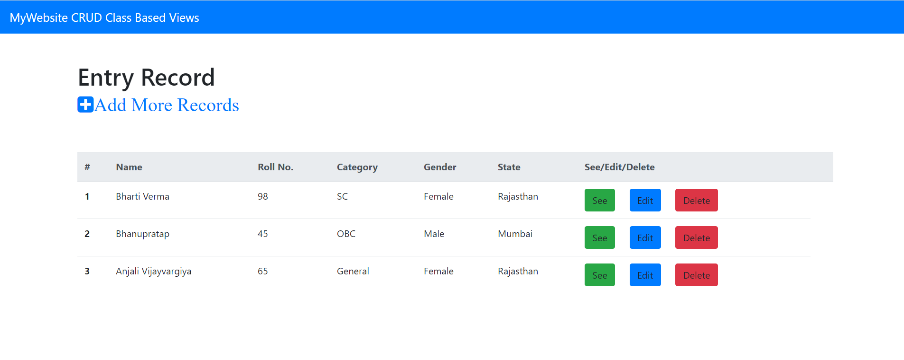

#### 13. WebProject13
###### Title: 13Django_CRUD_Operation_ClassBasedView_ImplementationinTableFormat_EntryDetails
A Small Project based on Class Based Views(CBV) implemented in Django. In this, a simple table format is prepared for making entries, checking their record, updating the record and deleting the particular record using CBV. While implementating this project, I have learnt many things:
1. How to use outer Bootstrap/HTML Templates outside the application folder.
2. How to give path for that template.
3. How to createsuperuser to see the admin page for watching the records in the database as well.
4. You can see admin page by the runserver-url/admin.
5. Understand the concept of form.as_p; form.as_table; form.as_ul.
6. How to use base.html file with the concept of Template Inheritance
7. Do not forget to call two commands after creation of model:
    1. python manage.py makemigrations
    2. python manage.py migrate
    3. then call; python manage.py runserver

ProjectName: WebProject13

ApplicationName: Web

###### Links:
1. https://www.geeksforgeeks.org/createview-class-based-views-django/
2. https://www.geeksforgeeks.org/listview-class-based-views-django/
3. https://www.geeksforgeeks.org/detailview-class-based-views-django/
4. https://www.geeksforgeeks.org/updateview-class-based-views-django/
5. https://www.geeksforgeeks.org/listview-class-based-views-django/
6. https://www.geeksforgeeks.org/class-based-generic-views-django-create-retrieve-update-delete/

For understanding the concept of makemigrations and migrate:
1. https://www.geeksforgeeks.org/django-basic-app-model-makemigrations-and-migrate/
2. https://stackoverflow.com/questions/29980211/django-1-8-whats-the-difference-between-migrate-and-makemigrations
3. https://dev.to/ashraf_zolkopli/django-makemigrations-migrate-collect-static-and-createsuperuser-15j8
4. https://sixfeetup.com/blog/django-migrate-or-makemigrations

###### Result:

