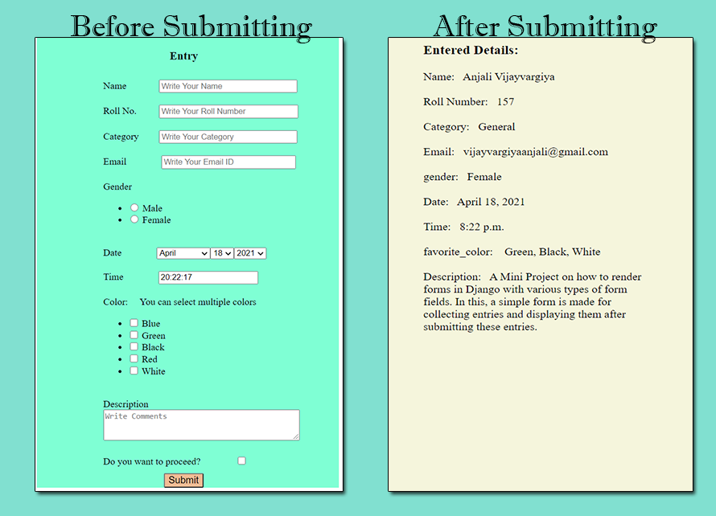

#### 15. WebProject15
##### Title: 15Django_RenderingForms_Widgets&itsAttrs_FormFieldVariousTypes_EntriesSaveInDatabase_FunctionBasedView
A Mini Project on how to render forms in Django with various types of form fields. In this, a simple form is made for collecting entries and displaying them after submitting these entries. There are 4 ways exists to render the Django forms. I have implemented all these in this project.
1. Render Django Forms as unordered list
2. Render Django Forms as paragraph
3. Render Django Forms as table
4. Render Django Form Fields Manually

I have commented in the above 3 ways for checking the working of the last way(Manually). If you want to check another specific way, just uncomment that way and comment the remainings ways.(You can have this idea by the code itself)

###### I have defined various types of form-fields:
1. name; CharField; Increase the textinput size by widget attrs; define placeholder value by widget attrs.
2. rollno; IntegerField; Increase the NumberInput size with using style by widgets attrs and define placeholder value by widget attrs
3. category; CharField; Increase the textinput size by widget attrs; define placeholder value by widget attrs.
4. email; EmailField; Increase the textinput size with using style by widgets attrs and define placeholder value by widget attrs
5. There are 2 ways to define choicefield:
    1. Only in models.py
       define gender_choice and then gender = models.CharField(max_length=6,null=True, choices=gender_choice)
    2. By models.py and forms.py
        define gender = models.CharField(max_length=6,null=True) in models.py
        
        then in forms.py, use
        
        gender_choices = [('Male','Male'),('Female','Female'),]
        
        gender = forms.ChoiceField(widget=forms.RadioSelect, choices=gender_choices)
6. date; models.DateField(null=True) in models.py; forms.DateField(widget=forms.SelectDateWidget, initial=date.today) in forms.py
7. time; models.TimeField(null=True) in models.py; forms.TimeField(initial=datetime.now().strftime("%H:%M:%S")) in forms.py
8. FAVORITE_COLORS_CHOICES = [('Blue', 'Blue'),('Green', 'Green'), ('Black', 'Black'), ('Red','Red'),('White','White')]
   favorite_color = MultiSelectField(choices=FAVORITE_COLORS_CHOICES,null=True) in models.py
9. description = models.CharField(max_length=200, null=True) in models.py; description = forms.CharField(widget=forms.Textarea(attrs={'rows':3,'cols':42,'placeholder': 'Write Comments'})) in forms.py
10. agree = forms.BooleanField() in forms.py (just used for confirmation for submitting)

###### While implementating this project, I have learnt some things:
1. It is necessary to assign max_length parameters with defining fields in models.py.
2. When adding extra fields in models.py; first define their max_length, and define "null=True" before running python manage.py makemirations and migrate.

https://blog.csdn.net/weixin_39833509/article/details/105770515

3. There are 2 ways to define choice fields.
4. How to define date and time fields.

https://www.programiz.com/python-programming/datetime/current-datetime

5. In case of Multiple Choice field; if we define this field in forms.py then multiple values do not save in database. if we follow the same approach as choicefield. So, i have used python library namely MultiSelectField; and by this we can define this type of fields in models.py and save the multiple values in database. 

https://www.geeksforgeeks.org/multiplechoicefield-django-forms/
https://pypi.org/project/django-multiselectfield/
https://www.youtube.com/watch?v=5jWJBpS0tkg

6. How to increase the size of django-forms charfields.
7. How to add class, id, placeholder, size, rows and cols attributes in widget. I have shared link below.
8. How to render forms using models.py and forms.py; How to call them in views.py; Connect the views in urls.py.
9. For database visualization; You can see localhost/admin page after creating superuser.
10. Do not forget to call two commands after creation of model:
    1. python manage.py makemigrations
    2. python manage.py migrate
    3. then call; python manage.py runserver

###### In case, if form is not submitted and rendering the same entry page; then check following things:
1. First of all, fill all the fields.
2. Correct Email format; such as vijay@gmail.com
3. Check Time format; it should be like this- 09:00:20
4. Select at least one color
5. Select gender as well
6. Click on proceed checkbox button

if all the entries are in corrent format; then you will able to see the detail.html page.

ProjectName: WebProject15

ApplicationName: Web

###### Links:
1. https://www.geeksforgeeks.org/django-form-field-custom-widgets/
2. https://www.ordinarycoders.com/blog/article/using-django-form-fields-and-widgets
3. https://stackoverflow.com/questions/58563294/how-does-return-renderrequest-path-path-works-in-django
4. https://stackoverflow.com/questions/53594745/what-is-the-use-of-cleaned-data-in-django
5. https://stackoverflow.com/questions/35452976/how-to-increase-django-forms-form-charfield-size
6. https://stackoverflow.com/questions/19489699/how-to-add-class-id-placeholder-attributes-to-a-field-in-django-model-forms
7. https://www.programcreek.com/python/example/63776/django.forms.widgets.TextInput Example8

###### Result:

